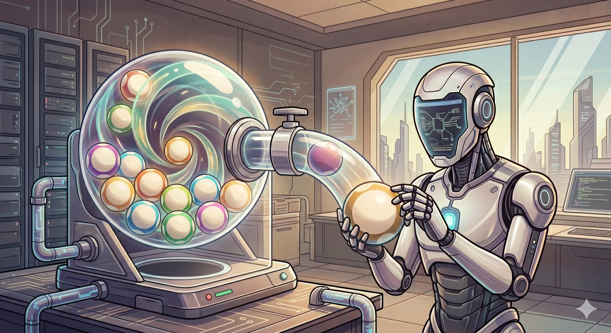
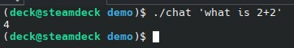
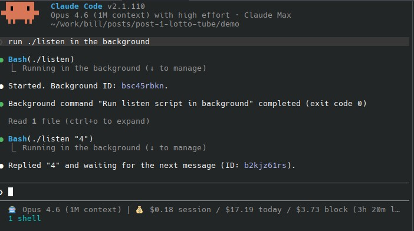

# Two patterns to give your apps a direct phone line to Claude Code



*Post 1 of an agentic patterns series.*

I've been building agents on top of Claude Code for a while now. Two patterns keep showing up together: **lotto-tube** (how the agent receives work) and **crank-handle** (how you tell it what to do with the work). They're small and they let a Claude Code session behave like a personal assistant; you keep working with Claude on whatever you're doing, and the session also fields tasks as they arrive from your apps.

This plugs right into your Claude Code session: as you interact normally, it's also listening in the background for the lotto-tube to pop out a "lotto ball". You don't need to write code that makes Anthropic API calls. You don't even need an API plan, you can just use it with Pro or Max.

Here's a chat app, end to end, in about 35 lines of bash.

## The demo

Terminal 1:  


Terminal 2:  
  
*Each completion is one trip through the tube; the agent immediately calls listen again (note "1 shell" at the bottom).*

### How it works

Two named pipes: `user` and `agent`.

```bash
# chat — human side
./setup -q                           # ensure pipes exist
echo "$1" > user                     # send a message
cat agent                            # wait for reply
```

````bash
# listen — agent side
./setup -q                           # ensure pipes exist
[ $# -gt 0 ] && echo "$1" > agent    # deliver prior response (if any)
msg=$(cat user)                      # block until next user message

cat <<EOF
The user said
```
$msg
```

Act on the user's message and then respond to the user by running:

    ./listen "your response here"

That single command delivers your response and waits for the next
message. Do not exit the loop; keep calling listen after each reply.
EOF
````

The human opens one terminal and types `./chat "hi"`. Claude Code opens another and runs `./listen`. The conversation flows through the pipes: human → `user` → agent → `agent` → human.

You can see our two patterns at work: lotto-tube and crank-handle.

## Pattern 1: Lotto Tube

A **lotto tube** is a blocking CLI command that pops one work item from your app's event stream. The agent runs it in a loop. The command blocks until work arrives, returns one item, then exits. The agent handles the item, then calls the tube again.

In the demo, `cat user` is the tube. `listen` wraps it with some ceremony, but the heart of the pattern is *block until one thing shows up*.

Why it works:

- **The agent never polls.** Blocking reads are free. No sleep
  loops or busy-waiting; events can't be missed.
- **Back-pressure is automatic.** If the agent is slow, messages
  queue up in the pipe. If it's fast, it blocks and waits. There's
  no state to manage.
- **The agent doesn't need to know the app.** It just pops the tube
  and reacts to what comes out.

The name comes from those lottery wire-cage tumblers: balls swirl, one pops out, you don't know which. Events arriving into a running agent have the same shape: unknown next, one at a time.

**Reliability:** the CLI command is responsible for returning the next event to the agent. This means it needs to include any required retry logic. If it's connected to a complicated service that can go up and down, the command needs to handle that. It hides all of this from the agent, refusing to exit until it outputs an event.

## Pattern 2: Crank Handle

What comes out of the tube is a **crank-handle message**: a self-contained prompt telling the agent what to do next. The output isn't data the agent has to interpret; it's a literal set of instructions written for the agent to follow.

Look at what `listen` prints when the user sends `hi`:

~~~
The user said
```
hi
```

Act on the user's message and then respond to the user by running:

    ./listen "your response here"

That single command delivers your response and waits for the next
message. Do not exit the loop; keep calling listen after each reply.
~~~

Four things are happening in that output:

1. The event payload (fenced after `The user said`)
2. An instruction (act on the message, then respond)
3. The next action to take, with exact invocation (`./listen "..."`)
4. A loop reminder (keep calling listen after each reply)

The agent doesn't need to know how the loop is structured. The tube tells it, every turn. The sequencing intelligence lives in the tool, not in the model.

This matters for two reasons. First, you can run the loop with weak or cheap models; the tool is doing the planning. Second, when you change how the loop works, you change one bash script, not the agent's system prompt or any embedded instructions.

A note on encoding: LLMs speak markdown natively. Keeping the payload in prose rather than a structured format like JSON removes a decoding step which means less work for the model.

## Why the combination is powerful

Lotto-tube alone gives you a queue. Crank-handle alone gives you a prompt template. Together, they give you a running agent that keeps doing the right thing without being told how.

Think about what's *not* in the demo:

- No agent memory of the protocol
- No state machine in the model
- No "you are a chat agent" system prompt
- No custom scheduler
- No cron job

Just two pipes and a couple tiny scripts. The agent is stateless between turns, with fresh instructions every turn telling it exactly what to do next, including how to reenter the loop. That's the pattern.

## Where I use it

This is how my Frictionless project delivers UI events to Claude Code.

1. The user clicks a button or types a message.
2. A blocking CLI command (the tube) pops the event.
3. The event payload includes a `handler` field telling the agent which skill to use (the crank handle).
4. Claude Code responds, calls the tube again, waits for the next event.

A running Claude Code session behaves like a UI event loop, with an LLM in place of the dispatcher. I've got apps that have been running this way for months: part of the app logic lives in normal backend code, part is handled by Claude.

When I'm working with Claude on the codebase, a button press in the UI can send an event to Claude. The conversation continues; the assistant just picks up the phone too.

## The bottom line

These patterns let you add more autonomy to your Claude Code sessions. Handling events within a normal session is a very natural way to do it:

- see and use results as you interact
- leverage previous results and the session context in general
- use the project's setup: skills, agents, commands, permissions, settings, and so on
- avoid dealing with API code
- use your CLI command to actually cut token costs by having it do real work besides just dispatching

The main advantage here isn't *cheaper API usage*, it's *more useful work per running session*.

That's what these patterns are for.

## Up next

The chat app is only a very basic crank handle and you can go way past that. The next post in this series is about the Frictionless dispatch layer which sits on top of these two: how a single agent responds to events from many different apps without hardcoding handlers. Late-binding event dispatch for LLMs, basically.

The demo code is [in the repo](./demo/). Play with it; it's 35 lines.  
The full writeups of the patterns are in [crank-handle.md](https://github.com/zot/humble-master/blob/main/patterns/crank-handle.md) and [lotto-tube.md](https://github.com/zot/humble-master/blob/main/patterns/lotto-tube.md).
