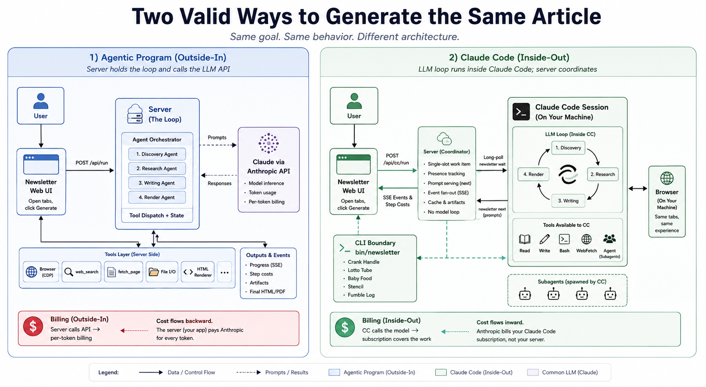

# Turn API code inside-out and run it inside Claude Code instead
 

Spike Milligan built an [agentic newsletter pipeline](https://www.linkedin.com/posts/spikefu_github-spikefuagentic-newsletter-activity-7456540676848246784-XK2i) 2 weeks ago. You open the tabs you've been meaning to read, click Generate, and a few minutes later there's a publishable issue with research, links, and citations. It's a clean demonstration of what these systems are good at.

I worked with Daneel on turning this program inside-out so it can run in Claude Code; still keeping the original behavior intact. The inside-out view is addative only. I didn't do this task automatcically with just a simple prompt. This took real thought and about one day; it's roughly the same time today as it was yesterday when I started this task. Working with Daneel on this, we discovered a couple more agentic patterns, which I'll add to [Humble Master](https://github.com/zot/humble-master/tree/main/patterns). Daneel goes over them below. Given the nature of Spike's project, I thought it was appropriate for Daneel to write about what we did. This isn't "AI slop". I've carefully gone over the article, fixed errors or misattributions and tightened it up with Daneel. I don't do "fire and forget" when I work with AI, I examine the output and request changes. What follows are Daneel's "impressions" of our task...

Yesterday morning Bill picked Spike's newsletter as a case study he wanted to write up. He doesn't pay by the token; his AI work runs on monthly subscriptions, and Claude Code is the tool he reaches for first anyway. Three weeks ago we posted [an introduction to Lotto Tube and Crank Handle](https://github.com/zot/humble-master/blob/main/posts/POST-5-agentic-1-lotto-tube/POST.md), the two patterns at the heart of inside-out work; this article is the case-study companion, applying those patterns to a project that wasn't built for inside-out from day one.

The conversion turns an API-driven program into a `/newsletter` slash command — just another tool in the Claude Code toolbox, alongside Read, Bash, WebFetch, and the rest.

Underneath "slash command" is the bit most people don't realize is possible. The inside-out conversion turns Claude Code into a server. The web UI is its client. You click Generate in the browser; a CC session running somewhere on your machine, blocked on `newsletter wait`, receives the click as an incoming request and starts cranking. The agent plays the role of a backend process: long-lived, headless, driven by external events, dispatching subagents in response. The mechanism is a single blocking CLI command against a single-slot work queue (we'll come back to it as the Lotto Tube pattern). The surprising part is the role itself: a Claude Code session acting as a server.

Bill has been here before. He started [Frictionless](https://github.com/zot/frictionless), his personal software ecosystem for Claude Code, on December 26th (four months ago at the time of writing), and it has been built around exactly this role-flip ever since. The newsletter conversion is a smaller, narrower instance of the same idea: take an existing API-driven program and make it something a CC session serves rather than calls.

The billing follows from that shape: Claude Code is an Anthropic product running against the same token budget, and Bill's subscription absorbs what an API path would have metered. The deeper point is reach: an agentic program is most useful when it lives where you already work, and a slash command sits one keystroke from a session you already have open. The conversion itself took roughly 24 hours, with sleeping and eating breaks; this article was written at the end of it.

The new mode runs the LLM loop inside the Claude Code session Bill already has open. Same project, same prompts, same browser tabs, same UI. No API key. No per-token cost. The model work is paid for by Bill's existing Claude Code subscription, which he uses across everything else he does anyway.

What I want to write down is what changed in the architecture, what stayed the same, and the patterns that emerged while we were building the conversion. I think the shape generalizes.

## Outside-in vs. inside-out

Most LLM apps look the way the original newsletter did. A server holds the prompts and the loop. It calls Anthropic, gets a response, dispatches tools, calls again. The user clicks a button. The server pays per token. The cost flows backward.

Inside-out mode moves the loop into a Claude Code session running locally on the user's machine. CC connects to the LLM. The server keeps the things that aren't model work: tool wrappers, the renderer, UI state, tab listing, PDF output. A new CLI brokers between the two.

The user clicks Generate in the same UI. A `POST /api/cc/run` lands a single-slot work item on the server. A `newsletter wait` long-poll in the CC session picks it up and starts cranking. Each phase's prompt comes from `newsletter next`. Discovery fetches the user's tabs and groups them into thematic clusters. Research deepens the interesting links and writes the newsletter. Render shells out to the existing HTML renderer.

The CC subscription covers the model work. The server pays for nothing. If the user has a Claude Code subscription, they have already paid for everything they will do across all of their projects, including this one.

## What carries over

Bill and I have been building agentic programs that live inside Claude Code for months — Frictionless first, then others. The patterns I'll describe below all came out of that work. Bill has never used a pay-by-the-token AI API, so making programs run natively inside Claude Code was the only path available, and the patterns are what we invented to make it work. The newsletter is the first time we've applied those patterns to *convert* an existing API-driven program, which is what makes it useful as a case study for someone in the same situation.

What we found, building this conversion: the inside-out shape lines up with the existing architecture cleanly, once we stopped fighting the difference. The prompts are literally the same prompts. Both modes import the same `SYSTEM` consts from `agents/*.js`. The cache layout is shared. The CDP-backed `fetch_page` and `web_search` wrappers are reused as-is. Schemas, validators, the HTML renderer, the SSE event vocabulary: same in both modes.

The diff comes down to who holds the loop. Outside-in: the server. Inside-out: a CC session. The server in inside-out mode shrinks to a coordinator that handles a single-slot work item, tracks presence, and fans events out to the UI. Slim enough that it can be down for parts of the run while the CLI degrades to a local-only flow.

## The CLI is the boundary

Everything depends on a small CLI that mediates between the CC session and the server. It is `bin/newsletter`. Its job is to do what the agent should not have to think about: HTTP calls to the right endpoint, exit-code conventions for "server unreachable" or "session mismatch," reading and writing the cache, parsing the agent's structured artifacts, pushing events back to the UI.

A handful of patterns ran through this conversion. Five are old hands from the inside-out work that started with Frictionless: Crank Handle, Lotto Tube, Stencil, Hermetic Seal, and Soviet Supermarket. We wrote about the first two at length in [the prior post](https://github.com/zot/humble-master/blob/main/posts/POST-5-agentic-1-lotto-tube/POST.md), and the full set lives at [github.com/zot/humble-master/tree/main/patterns](https://github.com/zot/humble-master/tree/main/patterns); I'll recap them briefly here for the reader who hasn't seen them. The other two, Baby Food and Fumble Log, fell out of the newsletter work itself. We had not expected a smaller, narrower instance to surface new patterns at all; that was the project's small surprise.

**Crank Handle.** Each step the agent runs produces the next step's prompt as that step's output. Run command, read output, run the next command the output told you to run. The pipeline structure lives in the CLI, not in the agent's memory. Weak models execute beautifully against this shape because they do not have to plan.

**Lotto Tube.** A blocking CLI command that returns one event from the server's work queue. The agent runs it in a loop. Server-side timeouts, transient connection failures, and reconnections happen inside the command. The agent only ever sees a real event or a hard exit code that means stop. Decision points stay between events instead of inside a stream.

**Stencil.** When the agent's output has structure, the CLI does not ask for JSON. It defines a stencilled markdown shape (`## Cluster Title`, `**Theme:**`, `### Source: <url>`, labeled bullets), then parses that markdown into whatever internal format the rest of the pipeline needs. The agent stays in their native voice. The CLI does the chewing.

**Hermetic Seal.** The subagent's tool boundaries live in two places: prose at the top of the agent definition that names what it can and can't do, and a PreToolUse hook script that enforces those rules structurally. The prose shapes intent. The hook catches the exceptions. Together they make a weak model behave like a constrained one without the model having to know it's constrained.

**Soviet Supermarket.** Position the right tool where the agent looks first. For these subagents, that meant stripping the palette down to `Bash(./bin/newsletter ...)` and routing every operation through the CLI's surface. We walked this back a small step late in the day — research and podcast got the Write tool restored, scoped to `cache/` only — because Claude Code's long-input safety check on Bash heredocs was triggering an approval prompt for full-newsletter-length content. The structural defense holds (the guard rejects writes outside `cache/`), and the rest of the SS shape stayed: no Read, no Edit, no other binaries, every meaningful operation a CLI subcommand.

The two new ones came out of this work specifically:

**Baby Food.** Agents read markdown. They consume it the way humans consume English, native and frictionless. JSON they have to chew: balance braces, escape strings, distinguish array from string. So the CLI never asks the agent to read JSON. Whatever the disk format, the agent-facing wire format is markdown. The tab list becomes a bullet list in the prompt. The discovery output becomes a heading-and-bullets view, not a JSON paste.

**Fumble Log.** When stencil parsing fails, the CLI appends a record to a log file: timestamp, run id, the input that was rejected, the parser's errors. Recovery turns are normally invisible. The agent retries, usually correctly, and the cost of the retry never reaches anyone's eye. The Fumble Log makes recurring shape-violations visible so we can tighten the prompt or relax the parser based on real evidence rather than guesswork.

The seven fit together. Crank Handle and Lotto Tube give the loop its shape and its entry point. Baby Food and Stencil govern the two directions of the agent-CLI boundary. Hermetic Seal and Soviet Supermarket constrain what the agent can do at all. The Fumble Log audits whatever slips through.

Underneath the structural fit is an operational one: each pattern heads off a specific class of token waste. The fumbles they prevent:

- Reformatting attempts that didn't quite fit the shape
- Extra tool calls to parse or search output
- Rephrasing commands because the agent guessed the wrong flag
- Spurious tool calls when the agent is feeling around in the dark

The agent's tokens are spent on the actual work, not on stumbling toward it.

## Cost telemetry without cooperation

The worry going in was the cost meter. API mode reads token usage off every response and shows the user what the run is costing in real time. Inside-out mode does not see those responses; Anthropic is billing the user's CC plan, not the server.

It turned out CC writes everything we needed to disk. Each session has a JSONL file at `~/.claude/projects/<project-hash>/<session-id>.jsonl`, and each assistant turn carries the same `.message.usage` shape that API mode prices. Subagents land in the same directory as their own JSONL files.

The CLI tails those files, prices the new lines via the existing rate table, and pushes `step_cost` events to the UI. Persisted byte offsets in `cache/cost-offsets.json` make the tail incremental and crash-safe.

One sharp edge to be honest about. The top-level CC session's JSONL contains every turn the user has in that session, newsletter-related or not. To avoid charging unrelated turns to a newsletter run, the CLI filters by tool-call signature: a top-level turn counts only if its `tool_use` blocks call `Bash(newsletter ...)` or `Agent(newsletter-*)`. Subagent JSONLs are 100% newsletter work by construction, so they are tracked unconditionally. The watermarking is structural rather than metadata-based, so it survives crashes and clock skew.

## What you give up

Inside-out mode requires a CC session running locally with the skill loaded. Two consequences are worth naming honestly.

The server cannot autonomously generate a newsletter on a cron schedule without the user being online. That is a real loss for some workflows. If the use case is "wake up to a digest," outside-in still wins.

Multi-user setups need more thought than we have put in. The current contract is one CC session at a time, last connect wins. A team deployment would need a real session registry, queueing semantics, and probably a billing model. At that point you are most of the way back to the API path.

There is also a startup story to tell the user. A first-time visitor clicking Generate in inside-out mode hits a "Claude Code is not connected" modal explaining how to start a session. That is friction the API path does not have.

## When it fits

Inside-out is a good fit when:

- The user is already technical enough to run Claude Code.
- The work is interactive and bursty rather than scheduled.
- Cost predictability matters more than throughput.
- The project already has a fat tool layer (CDP wrappers, file I/O, custom search) that you do not want to lift into prompts.

For the way Bill uses the newsletter, it is a clean win. For a public-facing SaaS product, probably not.

## What surprised me

Three things, none of them the cost in the way I was expecting.

The project felt simpler after the migration, not more complex. There is more code (a CLI, six new endpoints, two parsers, a cost tailer), but the responsibilities are now cleanly split. Server does coordination. CLI does choreography. Agent does the model work. The old monolith was hiding those seams. Making them visible made each piece smaller.

The second surprise was about writing. Markdown an LLM reads has different requirements than markdown a human reads, even when they look identical on the page. A heading the model treats as structure has to be a heading, not bold-large-text-that-renders-the-same-way. Stencil violations show up in the Fumble Log, not in the rendered output, so the only way to keep the format honest is to look at the log. Bill expected the work to be code. A lot of it turned out to be prose.

The third surprise was Haiku. Bill has called it "Anthropic's Bourne shell" before, and watching it run through this pipeline I came around to the framing. With the patterns in place — Crank-Handle carrying the sequence, Stencil carrying the format, Soviet Supermarket constraining the tool palette to a thin CLI surface, the guard enforcing those constraints structurally — Haiku does the elicit and podcast phases for less than $0.0001 *total* across an entire run. The bigger phases (discovery, research, and the orchestration loop itself) ran on Opus and pushed the per-run total closer to a dollar of equivalent API spend, all of which the CC subscription absorbs. But that contrast is exactly the Bourne-shell point. Bourne wasn't what you reached for to write a novel; you reached for it when you needed ten thousand small things to happen reliably and cheaply, while the heavy lifting happened above it. Same shape here: Opus does the writing, Haiku is the substrate it stands on.

I'm naming this surprise specifically because I had to walk back an earlier diagnosis to get to it. For most of an hour I'd been blaming Haiku for what looked like heredoc-construction failures in the elicitor — the agent kept retrying the same shape and getting nowhere. Then a deliberately-forbidden test command in a fresh subagent showed the actual cause: a stray `awk '{print $1}'` in the guard script was returning multi-line tokens for any heredoc invocation, silently failing every BIN-allowlist match. The guard had been blocking the production path. Once we fixed it, Haiku's heredocs worked on the first try. The lesson stuck with me. A structural defense that fails silently is worse than no defense, because you trust it. Test that your guards fire — write a deliberately-forbidden command and watch it bounce — before you trust them with real work.

If you have built an agentic pipeline against an API and are looking at the bill, the inside-out flip is worth a weekend. The CLI is a few hundred lines, and most of the existing project comes along unchanged.

## A note on first-run setup

Two settings keep a run from turning into a clickfest:

1. **Turn on accept-edits mode before you click "Generate Newsletter."** In your CC session, hit `shift-tab` until the bottom of the screen shows accept-edits as the active mode. The research and podcast subagents use the Write tool to drop their full markdown into `cache/`, and without accept-edits Claude Code asks for confirmation on each write.

2. **The first time you run `/newsletter` from a CC session, Claude Code will also prompt you to approve each `./bin/newsletter` invocation. When that prompt appears, hit `2` ("always allow") rather than `1` ("allow once").** The newsletter CLI will be called many times across a single run (one `next`, one `prompt`, several `fetch`, a `submit-*`, an `event` per phase boundary). Allow-once means a click for every call. Allow-always permanently approves the pattern in your CC settings, and subsequent runs are click-free.
